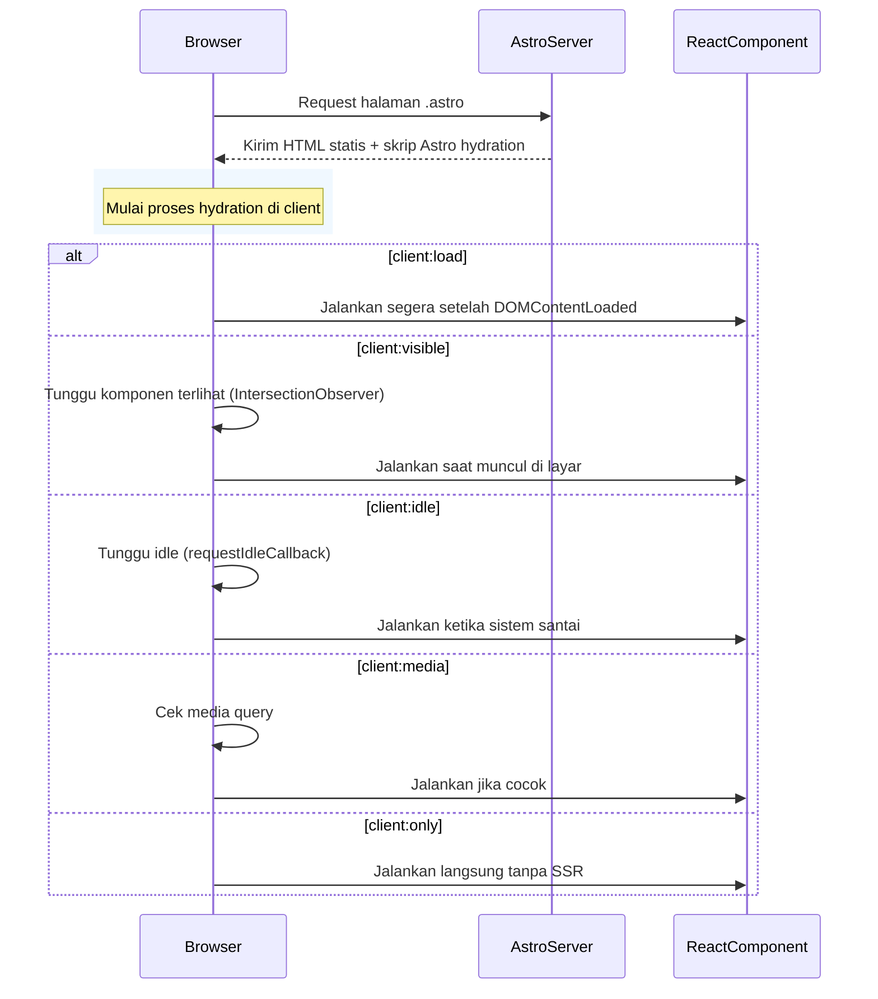

# 🌟 Astro Client Directives — Panduan Lengkap

## 📘 Pengantar

Secara default, Astro merender semua halaman di **server** (SSG/SSR).  
Namun, jika kamu menggunakan **komponen React / Vue / Svelte**, maka kamu perlu memberi tahu **kapan komponen tersebut dijalankan di browser (client-side).**

Itulah fungsi dari **client directives** seperti `client:load`, `client:visible`, dll.

---

## 🧩 Daftar Client Directives

Berikut semua directive bawaan Astro untuk komponen yang membutuhkan JavaScript di browser:

| Directive                | Render di Server | Render di Browser | Waktu Muat                                       | Cocok Untuk                               |
| ------------------------ | ---------------- | ----------------- | ------------------------------------------------ | ----------------------------------------- |
| _(tanpa directive)_      | ✅               | ❌                | N/A                                              | Static HTML                               |
| `client:load`            | ✅               | ✅                | Saat halaman selesai dimuat (`DOMContentLoaded`) | Chart, form interaktif                    |
| `client:visible`         | ✅               | ✅                | Saat pertama kali terlihat di viewport           | Lazy components, gambar besar             |
| `client:idle`            | ✅               | ✅                | Saat browser idle (setelah halaman selesai)      | Widget tambahan, analytics                |
| `client:media="(query)"` | ✅               | ✅                | Saat media query cocok                           | Komponen khusus desktop/mobile            |
| `client:only="react"`    | ❌               | ✅                | Segera di browser (tanpa SSR)                    | Full React app, library berbasis `window` |

---

## 🧠 Penjelasan Tiap Directive

### 🔹 `client:load`

Komponen dimuat **segera setelah halaman selesai dimuat di browser**.

```astro
<MyChart client:load />
```

- Cocok untuk grafik, tombol interaktif, atau UI dinamis.
- Render awal tetap dilakukan di server (SSR).
- Setelah itu Astro “hydrate” komponen di browser.

---

### 🔹 `client:visible`

Komponen hanya dimuat ketika **muncul di viewport** (lazy-load).

```astro
<GalleryGrid client:visible />
```

- Menghemat waktu muat halaman.
- Cocok untuk komponen berat di bagian bawah halaman.
- Menggunakan `IntersectionObserver` di belakang layar.

---

### 🔹 `client:idle`

Komponen dimuat **saat browser idle**, setelah halaman dan event utama selesai.

```astro
<FeedbackWidget client:idle />
```

- Tidak mengganggu render awal.
- Ideal untuk fitur tambahan seperti pop-up, analytics, live chat.

---

### 🔹 `client:media="(min-width: 1024px)"`

Komponen hanya dimuat **jika media query cocok.**

```astro
<Sidebar client:media="(min-width: 1024px)" />
```

- Berguna untuk responsive layout.
- Tidak akan dimuat di mobile jika tidak memenuhi query.

---

### 🔹 `client:only="react"`

Komponen **hanya dijalankan di client** tanpa rendering server.

```astro
<MyReactApp client:only="react" />
```

- SSR dilewati (server tidak menghasilkan HTML awal).
- Komponen baru muncul setelah React hydrate di browser.
- Cocok untuk library yang menggunakan `window`, `document`, `useLayoutEffect`, dsb.

⚠️ Hati-hati: SEO bisa menurun karena HTML kosong sebelum React render.

---

## 🧬 Diagram Alur Rendering



---

## 💡 Tips Produksi

- Gunakan `client:visible` sebanyak mungkin untuk performa optimal.
- Gunakan `client:only` hanya jika library tidak bisa di-SSR.
- Hindari terlalu banyak `client:load` pada halaman yang sama (berat di awal).
- Kamu bisa gabungkan directive dengan CSS/JS lazy-loading untuk hasil terbaik.

---

## 🧱 Contoh Praktik Terbaik

```astro
---
import HeroSection from '@components/HeroSection.jsx';
import ChartWidget from '@components/ChartWidget.jsx';
import FeedbackPopup from '@components/FeedbackPopup.jsx';
---

<HeroSection /> <!-- statis, tidak perlu JS -->
<ChartWidget client:visible /> <!-- hanya saat muncul -->
<FeedbackPopup client:idle /> <!-- muat setelah halaman siap -->
```

---

## 🧾 Referensi

- [Astro Docs — Framework Components](https://docs.astro.build/en/reference/directives-reference/#client-directives)
- [Astro Hydration Guide](https://docs.astro.build/en/core-concepts/component-hydration/)

---

© 2025 — Dokumentasi internal by **Wisnu Hidayat / Mitra Adira Utama**
